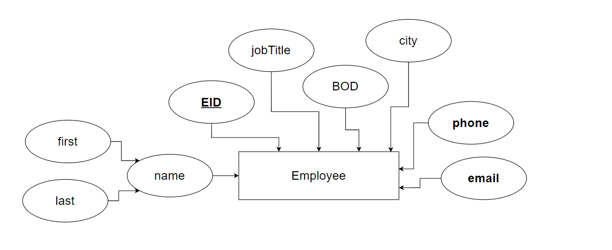
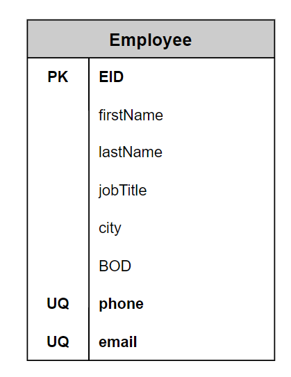

# Employee Management
### program for employee management created by java language and MySQL database.
* Selete data
* Update data
* Insert data
* Delete data
<hr>

### **ER diagram**

<hr>

### **relation model**

<hr>

### **structure table**
```SQL
use employeeManagement;

create table Employee(

EID varchar(25) not null,
firstName varchar(25),
lastName varchar(25),
jobTitle varchar(15),
city varchar(25),
BOD date,
phone varchar(10) unique,
email varchar(25) unique,
primary key(EID)

);
```
<hr>

### **Notes:**
* you need add [mysql-connector-java](https://dev.mysql.com/downloads/connector/j/) to project
* you must have:
    * port
    * database name
    * user name
    * password

